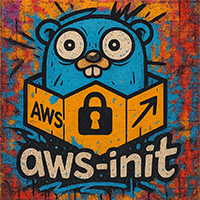

# aws-init

A lightweight init process for containers that securely resolves AWS Secrets Manager and AWS SSM Parameter Store values
at runtime.

Full documentation: [pkg.go.dev/cmecca.io/aws-init](https://pkg.go.dev/cmecca.io/aws-init)

## Installation
```shell
go get cmecca.io/aws-init@latest
```
## Usage
```shell
aws-init command [args...]
```
Set environment variables with `aws-secret:` prefixes:
```shell
export DATABASE_URL="aws-secret:myapp/prod#database_url"
export API_KEY="aws-secret:myapp/api"
aws-init python app.py
```
## Flags
- `-v` show version
- `-h` health check

## Secret Formats
**Secrets Manager:**
```shell
SIMPLE_SECRET=aws-secret:myapp/api
JSON_KEY=aws-secret:myapp/config#database_url
```
**Parameter Store:**
```shell
PARAMETER=aws-secret:/aws/reference/secretsmanager/myapp/token
```

## Authentication

Uses standard AWS credential chain (IRSA, instance profile, etc).

## License
See [LICENSE](./LICENSE) for terms.
## Disclaimer
Per the [NOTICE](./NOTICE), this is a personal project developed in my individual capacity. It is not affiliated with or endorsed by Amazon Web Services, Inc.

##
`aws-init` was built with Go 1.23


